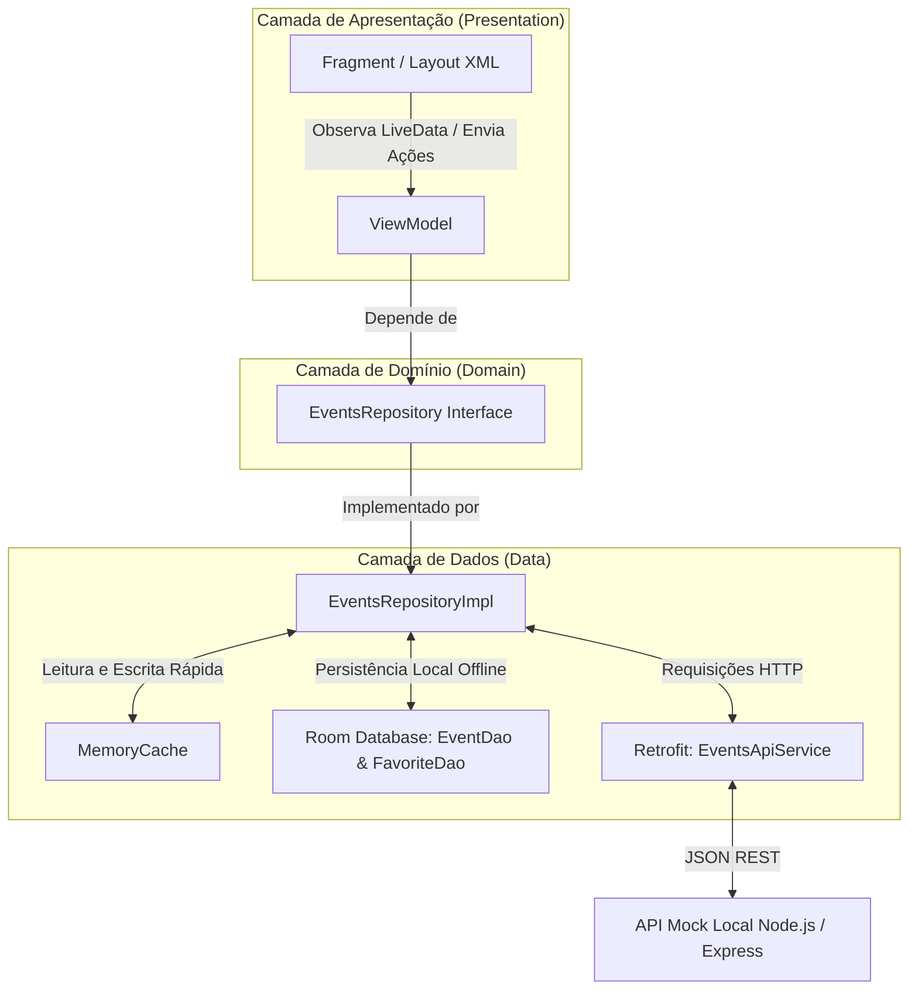

# 📱 Tech Events — Aplicativo Android Nativo

> **Aplicativo nativo para Android em Kotlin projetado para portfólio profissional, focado na descoberta, filtragem, consulta de detalhes, gerenciamento completo (CRUD) e favoritos de eventos de tecnologia.**


---

## 🎯 Objetivo do Projeto

O **Tech Events** foi construído do zero com arquitetura limpa e escalável baseada em **MVVM + Repository Pattern**, priorizando boas práticas da engenharia Android moderna:
- **Layouts XML Declarativos com DataBinding**: Interface fluida desenvolvida com Material Components e DataBinding.
- **Estratégia Offline-First & Resiliência**: Cache persistente embutido via **Room Database v2** e cache em memória thread-safe (`MemoryCache`) com sincronização automática de eventos semente (*seed data*).
- **Header Colapsável no Scroll**: Menu superior de busca, categorias e formatos com encolhimento automático dinâmico no scroll vertical (`AppBarLayout` + `CoordinatorLayout`).
- **Badges de Categoria Personalizados**: Badges no formato *Pill* (`corner_radius="16dp"`) com gradientes visuais exclusivos por tecnologia (*Android, Kotlin, Backend, Web, IA, Cloud, DevOps, Encerrados*).
- **Navegação com Single Activity**: Host central em `MainActivity` utilizando **Navigation Component** e **Safe Args**.
- **Injeção de Dependências Manual**: Gerenciada de forma desacoplada via `AppContainer` registrado no ciclo de vida da `Application`.
- **Suíte de Testes Automatizados**: Testes unitários para ViewModel, Repository, Mappers e Contrato de API com `MockWebServer`.
- **API Mock Local em Node.js/Express**: Servidor embutido no projeto com endpoints REST para testes de rede reais.

---

## 📸 Referência Visual & Demonstração

<p align="center">
  
</p>

O design visual reproduz com fidelidade a identidade do projeto:
- **Chips de Categoria com Cores Tecnológicas**:
  - 🟢 **Android**: Gradiente verde (`#1B5E20` $\rightarrow$ `#3DDC84`).
  - 🟣 **Kotlin**: Gradiente roxo-magenta (`#7F52FF` $\rightarrow$ `#C711E1`).
  - 🔵 **Backend**: Gradiente azul marinho (`#0D47A1` $\rightarrow$ `#3F51B5`).
  - 🌐 **Web**: Gradiente turquesa/ciano (`#006064` $\rightarrow$ `#00BCD4`).
  - 🤖 **IA**: Gradiente violeta futurista (`#4A148C` $\rightarrow$ `#E040FB`).
  - ☁️ **Cloud**: Gradiente azul celeste (`#01579B` $\rightarrow$ `#29B6F6`).
  - ⚙️ **DevOps**: Gradiente laranja rust (`#E65100` $\rightarrow$ `#FF9800`).
  - 🏁 **Encerrados**: Gradiente cinza grafite sobriedade (`#37474F` $\rightarrow$ `#78909C`).
- **Lista de Eventos Organizada**: Eventos ativos e futuros são priorizados no topo da lista, enquanto eventos finalizados são posicionados automaticamente ao final da listagem.
- **Detalhes do Evento**: Banner com gradiente fallback, card sobreposto com badges coloridos, ações de favoritar, compartilhar nativo (`Intent.createChooser`), integração com Google Maps (`geo:`) e exclusão segura.
- **Formulário de Gerenciamento (CRUD)**: Formulário para criação e edição com seletores de data/hora (`DatePickerDialog`, `TimePickerDialog`), validação em tempo real e prevenção de alterações não salvas.

---

## 📊 Diagrama do Fluxo de Dados (Mermaid)



---

## 🛠️ Stack Tecnológica

| Componente | Tecnologia |
| --- | --- |
| **Linguagem** | Kotlin 2.0.20 |
| **Arquitetura** | MVVM (Model-View-ViewModel) + Repository Pattern |
| **Injeção de Dependências** | Manual via `AppContainer` registrado na classe `Application` |
| **UI & Layouts** | XML, Material Components 3, DataBinding, CoordinatorLayout + AppBarLayout |
| **Navegação** | AndroidX Navigation Component com Safe Args |
| **Persistência Local** | Room Database v2 (Entities, DAOs, Migrations) + MemoryCache |
| **Rede & HTTP** | Retrofit 2, OkHttp 4, Gson, HttpLoggingInterceptor |
| **Concorrência** | Kotlin Coroutines (`viewModelScope`, `Dispatchers.IO`) |
| **Splash Screen** | AndroidX Core SplashScreen (`core-splashscreen`) |
| **Carregamento de Imagens** | Glide 4 |
| **Testes Unitários** | JUnit 4, kotlinx-coroutines-test, Mockito, Mockito-Kotlin, Arch Core Testing, MockWebServer |
| **API Mock Local** | Node.js v22, Express, CORS |

---

## 📁 Estrutura do Projeto

```
com.dierlisson.techevents
├── core
│   ├── binding        # BindingAdapters para DataBinding
│   ├── di             # Injeção manual de dependências (AppContainer)
│   ├── network        # Sealed Interface NetworkResult e cliente HTTP
│   └── util           # Utilitários (CategoryUtils, NetworkUtils)
├── data
│   ├── cache          # MemoryCache thread-safe
│   ├── local
│   │   ├── dao        # Room DAOs (EventDao, FavoriteDao)
│   │   ├── database   # TechEventsDatabase (v2)
│   │   └── entity     # Entidades Room (EventEntity, FavoriteEntity)
│   ├── mapper         # Mappers puros (EventMapper: DTO <-> Domain <-> Entity)
│   ├── remote
│   │   ├── api        # Retrofit EventsApiService
│   │   └── dto        # DTOs remotos (EventDto, CreateEventDto)
│   └── repository     # Implementação do repositório (EventsRepositoryImpl)
├── domain
│   ├── model          # Modelo de domínio puro (Event)
│   └── repository     # Interface desacoplada (EventsRepository)
└── presentation
    ├── adapter        # EventsAdapter (ListAdapter com DiffUtil e paginação)
    ├── events
    │   ├── detail     # EventDetailFragment, EventDetailViewModel, Factory
    │   ├── form       # EventFormFragment, EventFormViewModel, Factory
    │   └── list       # EventsListFragment, EventsListViewModel, Factory
    ├── main           # MainActivity (Host do NavHostFragment)
    ├── splash         # SplashFragment, SplashViewModel
    └── state          # Sealed interfaces de estado (UiState, EventsUiState, PaginationState)
```

---

## ⚙️ Instruções de Configuração e Execução

### 1. Clonar o Repositório

```bash
git clone https://github.com/dierlisson/TECH-EVENTS.git
cd TECH-EVENTS
```

### 2. (Opcional) Iniciar a API Mock Local em Node.js

O aplicativo possui resiliência offline embutida via Room DB com sementes padrão. Caso queira rodar o servidor mock REST:

```bash
cd mock-api
npm install
npm start
```
*A API iniciará no endereço `http://localhost:3000`.*

### 3. Configurar a Base URL do Aplicativo

A URL base da API é definida no arquivo `app/build.gradle.kts` via `BuildConfig.BASE_URL`:

- **Emulador Android Studio (Padrão)**: `http://10.0.2.2:3000/`
- **Dispositivo Físico**: Altere para o IP local da sua máquina (ex: `http://192.168.1.15:3000/`).

### 4. Compilar e Executar o App Android

```bash
# Compilar projeto em modo Debug
.\gradlew.bat assembleDebug

# Executar a suíte de testes unitários (100% aprovados)
.\gradlew.bat testDebugUnitTest
```

---

## ⚡ Funcionalidades e Regras de Negócio

- **Paginação Infinita por Deslocamento**: Carregamento em blocos de 10 eventos (`offset=0&limit=10`). O rodapé exibe indicador de carregamento, mensagem de erro com retry ou fim de lista.
- **Busca com Debounce**: Pesquisa por texto com **debounce de 400ms** cobrindo título, descrição, categoria, organizador, cidade e estado.
- **Filtros Combinados de Categoria & Formato**: Seleção exclusiva em chips horizontais de categorias (*Android, Kotlin, Backend, Web, IA, Cloud, DevOps, Encerrados*) e formatos (*Todos, Presencial, Online, Somente Favoritos, Finalizados*).
- **Priorização de Eventos Ativos**: Eventos futuros aparecem no topo da listagem, e eventos encerrados são posicionados automaticamente no final.
- **Favoritos Persistentes (Offline)**: Armazenados sincronicamente no Room.
- **CRUD Completo de Eventos**:
  - **Criação (POST)**: Formulário com DatePicker, TimePicker e validações.
  - **Edição (PUT)**: Preenchimento automático e atualização sincronizada no Room e API.
  - **Exclusão (DELETE)**: Confirmação via diálogo e remoção local/remota.
- **Integrações Nativas**: Redirecionamento para o Google Maps via Intent `geo:` e compartilhamento nativo de eventos.

---

## 👨‍💻 Autor

**Dierlisson Justiniano**

